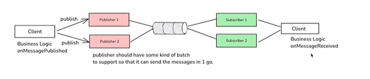

# v4

In this version we will focus on giving client the ability to run custom code after receiving the message. This is important because untill now, we were just listening to the messages.  

In real life, after receiving the message, a lot of processing is done, i.e. custom code is executed. This is also called callback.

  
Now since this(codebase) has to be a library, the general pub/sub system has to be made so that client know whether the mesasage is published. If so, client may want to run some custom code. Same goes for subscriber.

This is where we have to use callbacks e.g. onMessagePublished() or onMessageReceived()  

This is similar to client libraries like kafka or rabbitmq
Now how can we impl callback?  

Approaches:
- By introducing interfaces
- By abstract classes  


To implement this, we use abstract classes. We can create a method for callback, which needs to be implemented by client based on requirements.
- We cannot use interfaces because, say we have one interface for callback called onMessageReceived having one method.
    - We need to implement this method. But what if later we introduced new functionality for onConnectionEstablish?
        - In this case we need to implmement that too, this will break all existing codebase.


Usage in main
Note: In this we fulfilled
    - Custom callback from users
```java
public class Main {
    public static void main(String[] args) throws InterruptedException {
        ExecutorService service = Executors.newFixedThreadPool(5);
        MessageBroker messageBroker = new MessageBroker();

        Publisher orderUpdatesPublisher = new OrderUpdatesPublisher("order-updates", messageBroker);
        Subscriber orderUpdatesSubscriber = new OrderUpdatesSubscriber("order-updates", messageBroker);

        Publisher notificationUpdatesPublisher = new NotificationUpdatesPublisher("notification-updates", messageBroker);
        Subscriber notificationUpdatesSubscriber = new NotificationUpdatesSubscriber("notification-updates", messageBroker);

        service.submit(orderUpdatesPublisher);
        service.submit(orderUpdatesSubscriber);
        service.submit(notificationUpdatesPublisher);
        service.submit(notificationUpdatesSubscriber);

        orderUpdatesPublisher.publish("Order 1 placed");
        orderUpdatesPublisher.publish("Order 2 placed");
        orderUpdatesPublisher.publish("Order 3 placed");
        
        notificationUpdatesPublisher.publish("Notification for order 1");
        notificationUpdatesPublisher.publish("Notification for order 2");
        notificationUpdatesPublisher.publish("Notification for order 3");

        Thread.sleep(3000);

        messageBroker.stop();
        service.shutdown();

    }
}
```